Wild Killer
-------------------------

Third-person survival game for Unreal Engine 4 made entirely in C++. Originally built as a practice for Epic Games, now available as open-source C++ sample project.

## Project Overview

The C++ Course features include building of a C++ game framework including an "action system" and event-driven code for flexible and re-usable game code the "unreal way". Multiplayer features, AI bots, SaveGame system, async loading of content, UMG menus and UI and so much more!

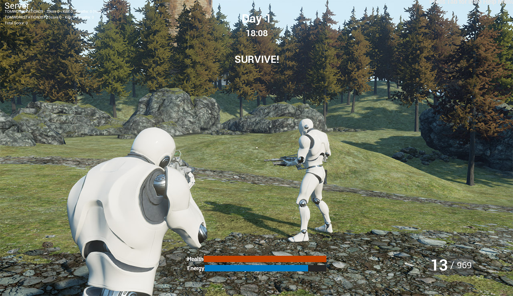

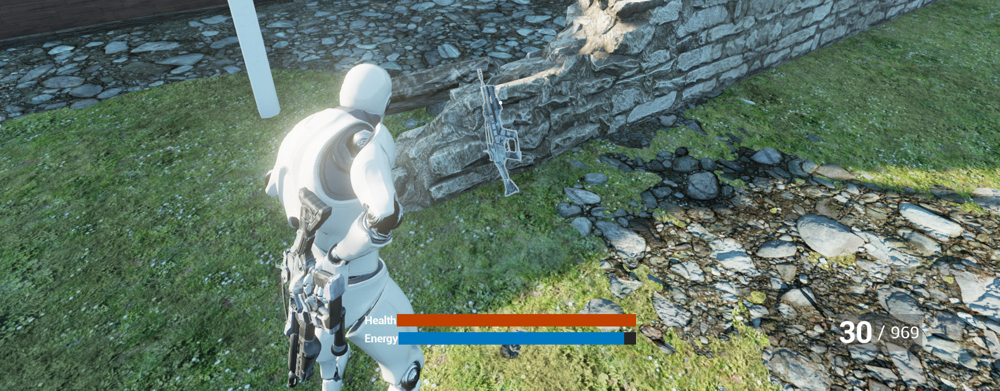

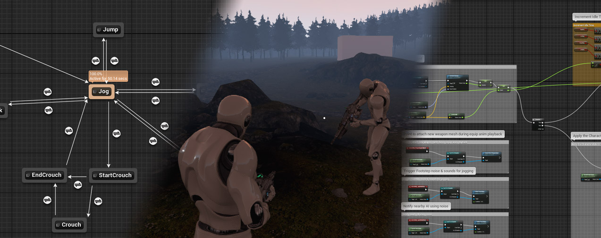

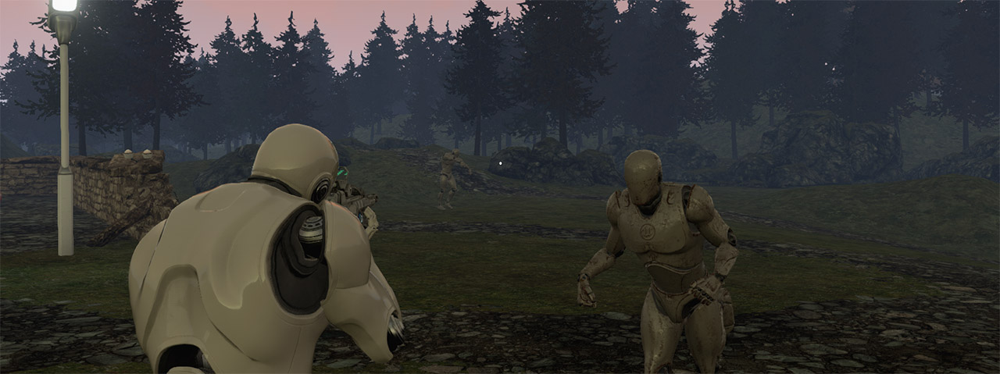

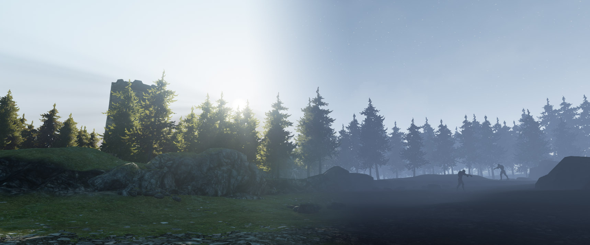

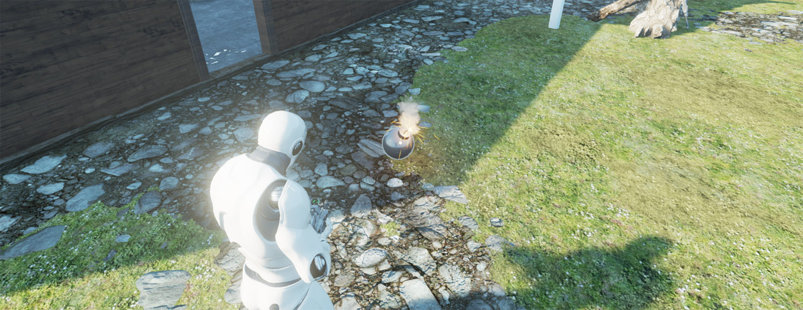

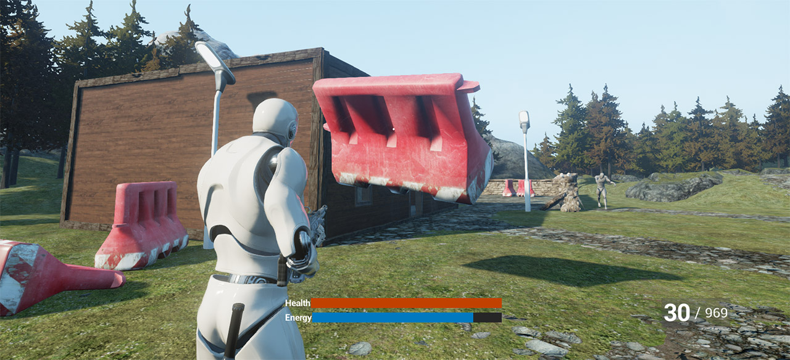

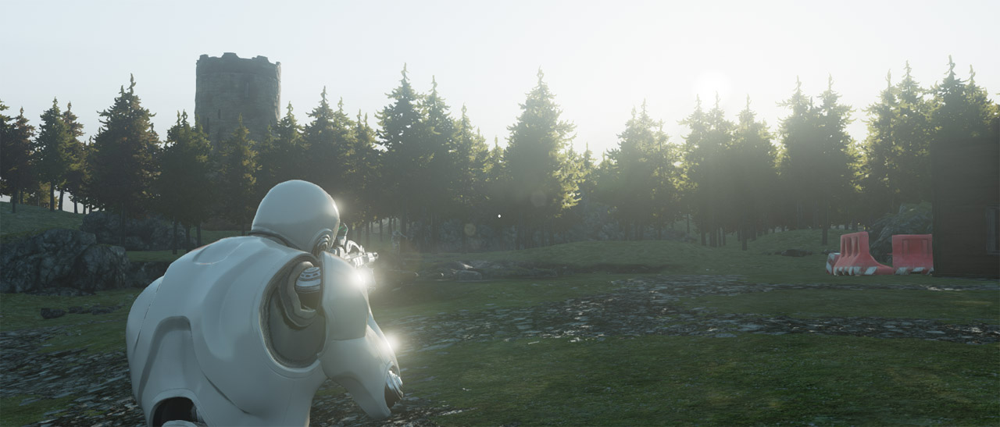

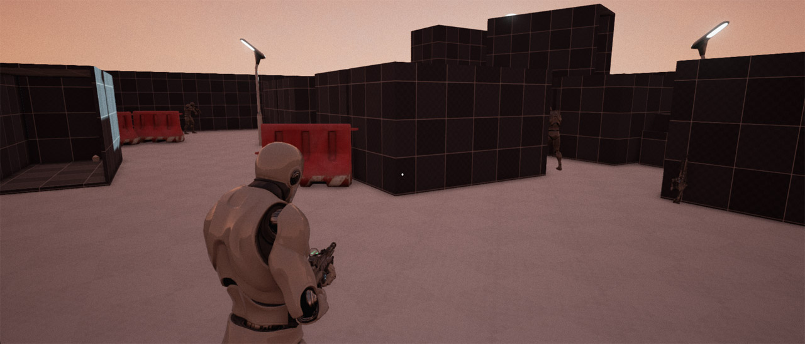

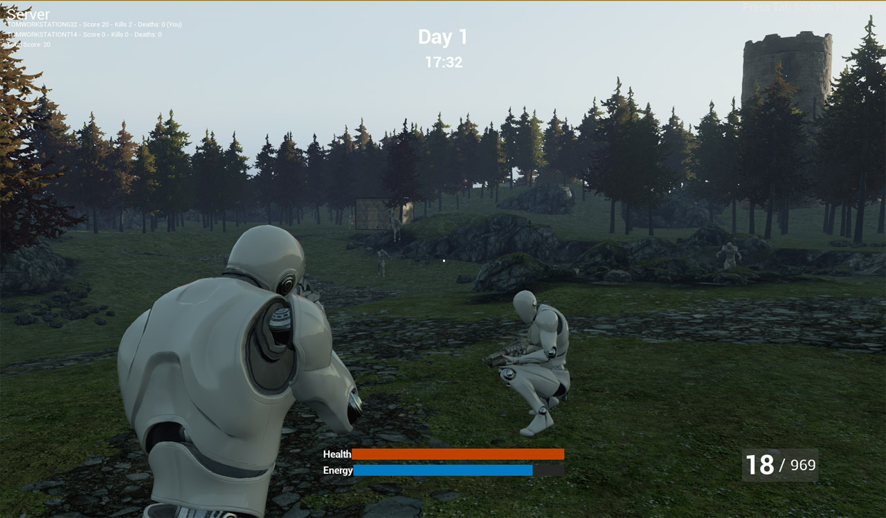

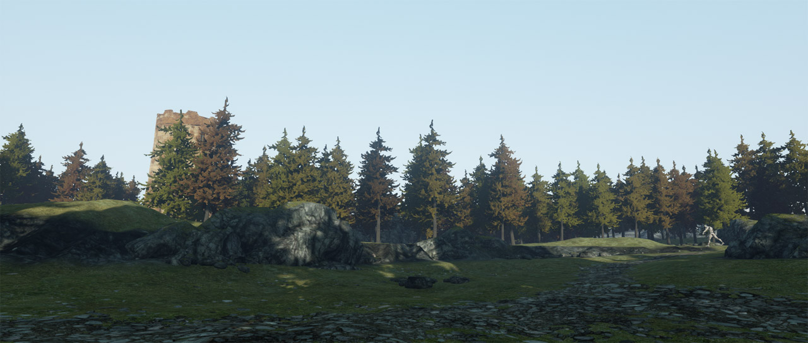

## Documentations

### Section 1

This section sets up the third person character movement with animation, object interaction, simple hunger system, all with networking support.

- [Documentation page](https://www.moichia.com/survival-sample-game-for-ue4/section-one/)

### Section 2

Adds weapon support for the character, a flashlight, UT-style inventory with on-character visual representation of the carried items and deals with damage, death and respawns for players.

- [Documentation page](https://www.moichia.com/survival-sample-game-for-ue4/section-two/)

### Section 3
Introduces AI "Zombie" enemy to our game using PawnSensing and Behavior Tree.

- [Documentation page](https://www.moichia.com/survival-sample-game-for-ue4/section-three/)

### Section 4
Introduces a gameloop with enemies, items, scoring and a time of day.

- [Documentation page](https://moichia.github.io/old-ue4-wiki/pages/survival-sample-game-section-4.html)

### Section 5

Introduces the ability to carry around objects like barriers and discusses game networking.

- [Documentation page](https://moichia.github.io/old-ue4-wiki/pages/survival-sample-game-section-5.html)

### Section 6

The final section in the series focuses on bug fixing and a bit of polish to the existing features. This section is compatible with the 4.8 release.

- [Documentation page](https://moichia.github.io/old-ue4-wiki/pages/survival-sample-game-section-6.html)
